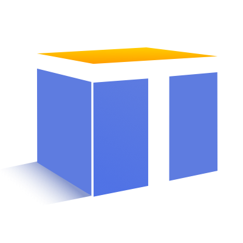

<p align="center">
  <a href="">
    
  </a>
</p>

<h1 align="center">
TinyNG
</h1>

<div align="center">

基于 Angular + TypeScript 的企业级 Web UI 组件库。

</div>

[English](README.md) | 简体中文

## 特性

- 70+ 开箱即用的高质量 Angular 组件。
- 支持 OnPush 模式。
- 使用 TypeScript 开发。
- 利用 CSS variables 提供强大的主题配置能力。
- 支持 7 种 国际化语言。

## 支持环境

* Angular `^14.0.0`
* 现代浏览器

| Edge | Firefox | Chrome | Safari |
| --------- | --------- | --------- | --------- |
| last 3 versions | last 3 versions | last 3 versions | last 2 versions |

## 安装

```bash
$ npm install @opentiny/ng
```

## 使用

将想要使用的组件模块引入到你的模块中。

```ts
import { TiButtonModule } from '@opentiny/ng';

@NgModule({
  imports: [ TiButtonModule ]
})
export class AppModule {
}
```

然后在 `angular.json` 文件中引入全局样式文件。

```diff
{
  "styles": [
+    "node_modules/@opentiny/ng/themes/styles.css",
+    "node_modules/@opentiny/ng/themes/theme-default.css",
  ]
}
```

可参考官网 [快速上手](https://www.opentiny.design/tiny-ng/docs/getstart) 了解更多。

## 开发

```bash
$ git clone 代码仓 clone 地址
$ cd ng
$ npm install
$ npm start
```

浏览器会自动打开。

## 更新日志

详细的变更内容请在 [change logs](CHANGELOG.md) 查看。

## 常见问题

我们已经收集了一常见问题[常见问题](https://www.opentiny.design/tiny-ng/docs/faq)。在提 issue 前，请先在常见问题中查找你的问题是否已有答案。

## 如何贡献

我们欢迎所有的贡献。请随时贡献代码或提出您的想法。

在提交你的任何想法之前，请先阅读我们的[贡献指南](CONTRIBUTING.md) 。

## 授权协议

[MIT](LICENSE)


