## 简介

 TinyUI Theme - 主题配置系统是一款旨在提高开发效率的的主题配置平台。让开发者更专注、让风格更多变。 即支持基于模板主题定制又支持细粒度的视觉需求，为用户打造更好的用户体验。 

## 核心流程

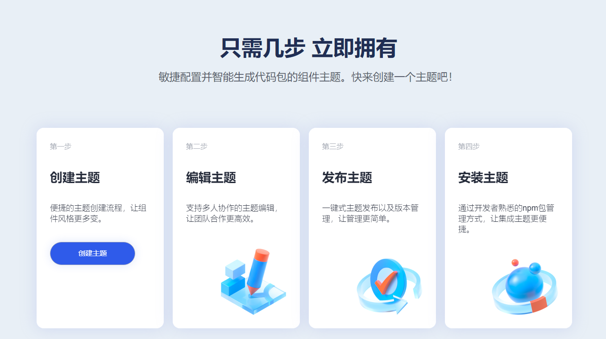

## 创建主题

[主题配置系统](https://tinyuidesign.cloudbu.huawei.com/designtheme/home)支持用户创建一个基于组件默认样式的主题，也支持用户复制主题商店中已有的主题。

#### 创建主题

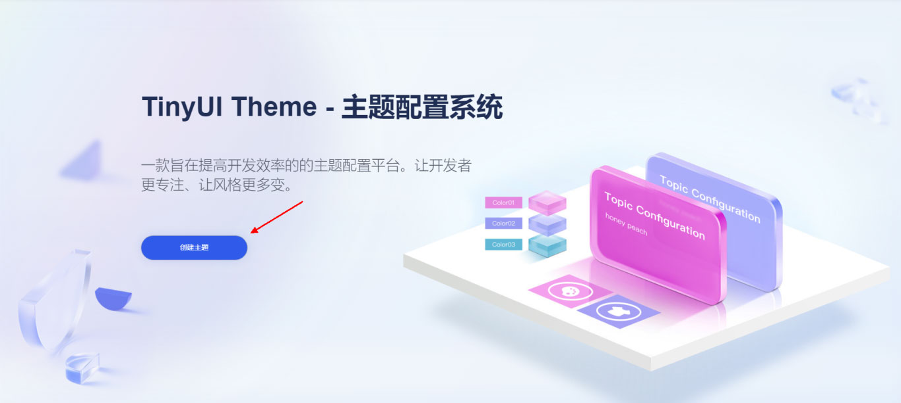

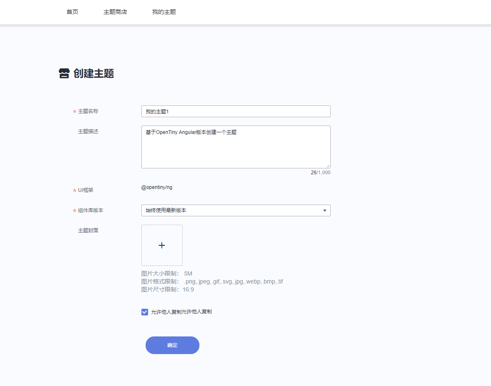


#### 复制主题

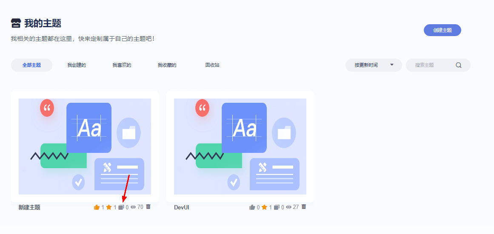

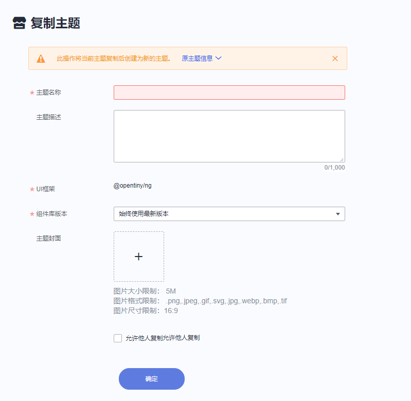

## 编辑主题

支持多人协作的主题编辑功能，满足用户多样化的产品需求。进入[我的主题](https://tinyuidesign.cloudbu.huawei.com/designtheme/userThemes)列表页，点击需要编辑的主题，进入主题编辑页，定制属于自己的主题风格。

+ 样式配置主要分为基础样式类和组件的样式类配置。
+ 基础样式的修改会影响到全局组件的样式。 基础样式包含了TinyUI设计系统中定义的一系列的基础变量（token），如颜色，字体，尺寸等。它们作为基础变量，被Button，Text等基础组件所引用。

#### 基础样式：以颜色为例

品牌色支持基于基色修改并由算法自动生成一套色阶。

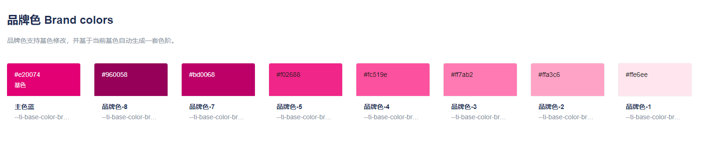

支持单个颜色的调整以满足产品的需求

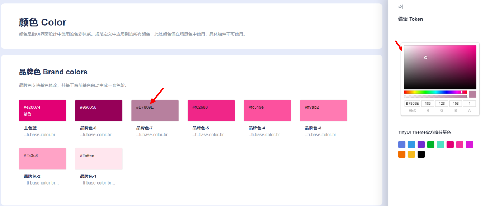

基础样式颜色变量（token）的修改会影响到组件的风格

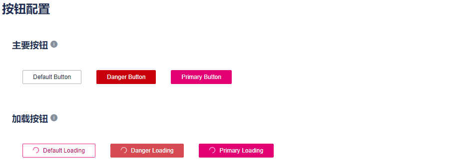

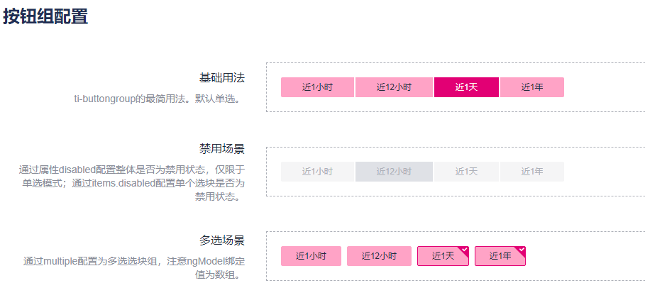

#### 组件样式

TinyUI 组件开放了细粒度的组件配置，在基础样式无法满足要求时，支持用户细粒度的定制组件。

+ 支持边框圆角的配置

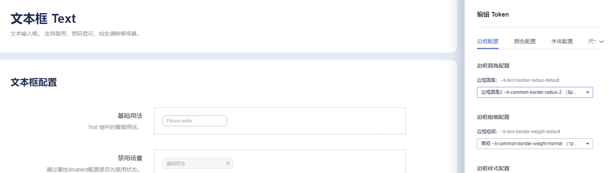

+ 支持默认背景色的配置

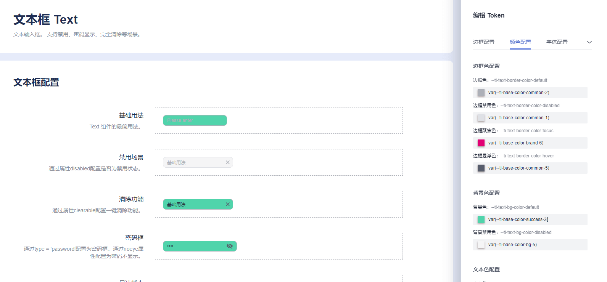


## 发布主题

点击发布后，将用户的配置转换成代码。 一键式主题发布以及版本管理，让管理更简单；安装后即可使用，让开发者更专注。 

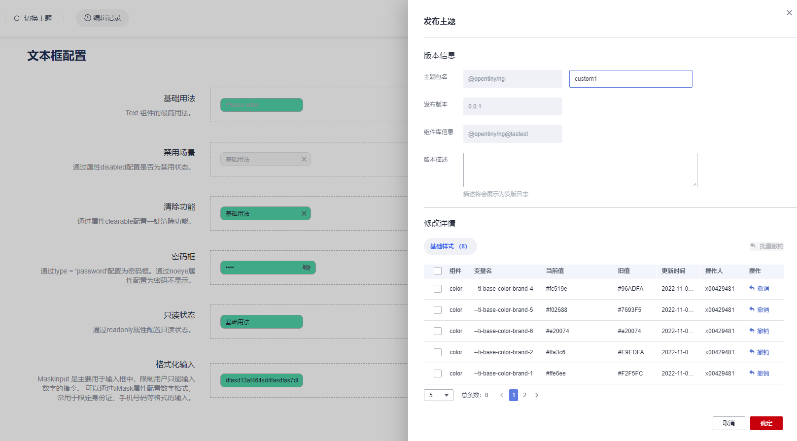


## 安装使用主题

发布成功后，用户可以通过npm install的方式安装主题，以` @opentiny/ng-custom1` 为例。

#### 安装

```javascript
npm install @opentiny/ng-custom1
```

#### 在项目中使用

修改angular.json文件中styles字段

```json
"styles": [
    "node_modules/@opentiny/ng/themes/theme-default.css", // 组件样式
    "node_modules/@opentiny/ng/themes/styles.css", // 组件样式
    "src/styles.css",
    "node_modules/@opentiny/ng-custom1/index.css" // 新增
],
```

#### 效果

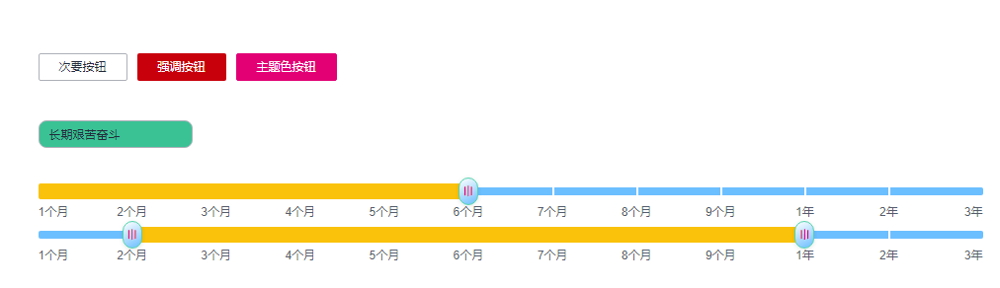
